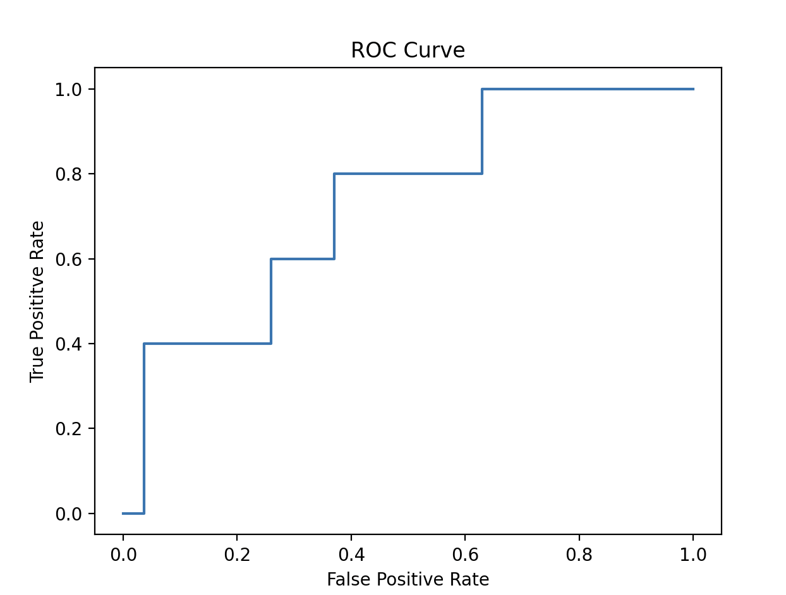
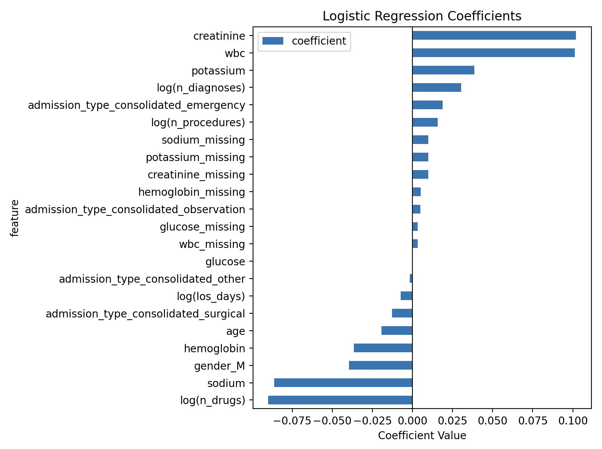

# Readmission Risk Predictor
ML pipeline predicting 30-day hospital readmission risk for MIMIC-IV clinical data. Featuring DuckDB, logistic regression modeling, and coefiicient-level interpretability.

## Overview
Hospital readmission within 30 days of discharge is a key metric of healthcare costs in the U.S. This project builds an interpretable ML pipeline to predict readmission risk from structured EHR data, using the publicly available MIMIC-IV Demo dataset.

The project covers a full lifecycle of cohort construction, exploratory data analysis, feature engineering, and model training/evaluation. 

**Dataset:** [MIMIC-IV Demo v2.2](https://physionet.org/content/mimic-iv-demo/2.2/)
(PhysioNet, open access)
**Cohort:** 260 patients, first admission only
**Readmission rate:** 15.8%

---

## Quickstart
```bash
# Install dependencies with uv
uv sync

# Place MIMIC-IV demo CSVs in data/raw

# Run feature engineering
uv run python -m src.pipeline.features

# Train model
uv run python -m src.models.train
```

## Methods

### Cohort Definition
- Patients on their first admission
- Excludes in-hospital deaths
- **Label:** readmitted to hospital within 30 days of discharge date 

### Feature Engineering
| Group | Features |
|---|---|
| Demographics | Age, gender (one-hot) |
| Admission | Consolidated admission type (Emergency / Observation / Elective / Surgical), log(LOS days) |
| Comorbidities | log(diagnosis count) |
| Labs | Last recorded creatinine, glucose, hemoglobin, sodium, potassium, WBC — median imputed + missingness flags |
| Medications | log(unique drug count) |
| Procedures | log(procedure count) |

Key feature engineering decisions informed by EDA:
- **Log transforms** applied to all right-skewed count features (LOS, diagnoses, procedures, drugs) to reduce outlier influence and improve logistic regression fit
- **Missingness flags** added for all lab values — whether a lab was ordered is itself a clinical signal
- **Admission type consolidated** from 8 granular MIMIC categories to 4 clinical buckets to avoid sparse one-hot columns
- **High-risk drug binary flag dropped** - ~97% prevalence in both groups made it non-discriminative in an ICU setting where these medications are standard of care

### Model
Logistic Regression with `class_weight="balanced"` to handle the 5:1 class imbalance between non-readmitted and readmitted patients. Features scaled with `StandardScaler` prior to fitting.

### Evaluation
Stratified train/test split with `stratify=y` to preserve class balance across splits.

## Results
| Metric | Score |
|---|---|
| Test Accuracy | 81% |
| Precision | 0.4 |
| Recall | 0.4 |

### ROC Curve



The ROC curve shows meaningful discrimination above the random baseline diagonal. The staircase shape reflects the small test set where each threshold change produces large discrete jumps rather than a smooth curve. This is expected at this sample size and is not a model quality issue.
 
 ### Top Predictive Features (Logistic Regression Coefficients)

 

 ---

 ## Limitations
 - **Sample size:** MIMIC-IV demo contains 260 patients. The results should be interpreted as proof-of-concept, not a clinically validated model.
 - **No temporal features:** Time-series data for vitals or labs was not used. Incorporating these would likely improve performance.
 - The pipeline is meant to scale to the full MIMIC-IV dataset with minimal code changes.

